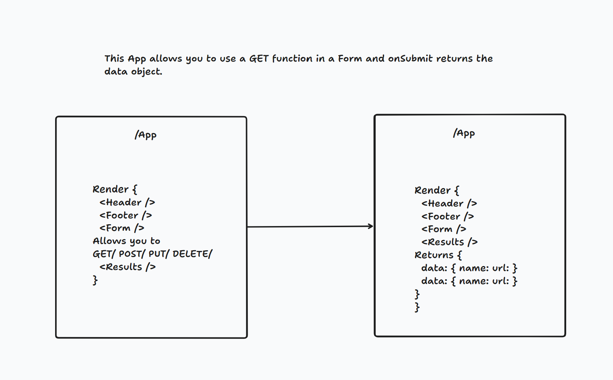

# resty

## Getting Started
Requirements
For development, you will only need Node installed in your environment. Please use the appropriate Editorconfig plugin for your Editor (not mandatory).

## Install
git clone https://github.com/preveira/resty.git
cd PROJECT
npm install
Configure app
Any environment configuration steps.

## Start & watch
npm run dev
npm start
Architecture
Describe how the project is structured.

## Documentation

## Languages & tools
Explain what tools are used.

## Change Log
List versioned releases.

## Collaborators
List collaborators here.